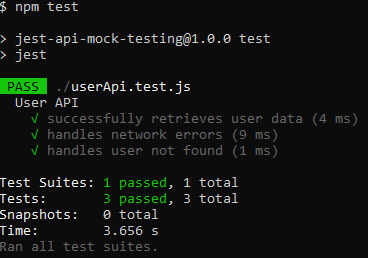

# Jest API Mock Testing

## Objective

Expand your testing capabilities by integrating and testing third-party API calls in a Node.js application using Jest. This assignment focuses on creating mock functions to simulate API calls, allowing you to test your application's response to various scenarios such as successful data retrieval and error handling.

## Setup and Installing Dependencies

- Clone repository:

```bash
git clone github-repository-url
cd jest-api-mock-testing
```

- Initialize Node.js Project:

```bash
npm init -y
```

- Install dependencies:

```bash
npm install --save-dev jest
npm i axios
```

- Add test script:

```json
"scripts": {
  "test": "jest"
}
```

## Running Tests

Run the following command in git bash:

```bash
npm test
```

## Testing Approach

### API Integration

Implemented a function to fetch user data from the JSONPlaceholder API using Axios.

### Testing with Jest

Utilized Jest's mocking capabilities to simulate API calls and test different scenarios:

- **Successful Data Retrieval :** Checked if the user data is fetched successfully.
- **Error Handling :** Covered scenarios for network errors and user not found errors.

### Async Testing

Used async/await for asynchronous testing and error handling during API calls.

## Testing Results


